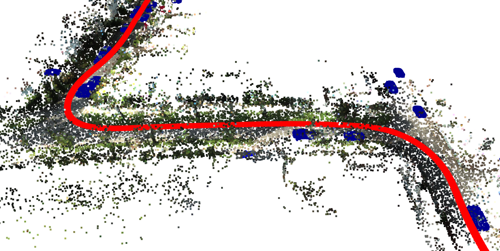
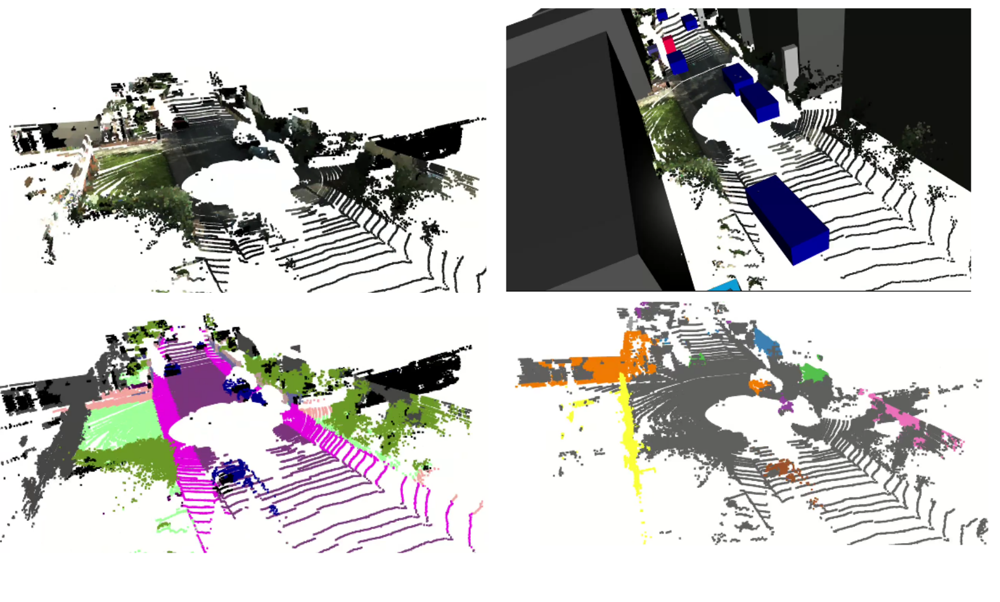

# pyLiDAR-SLAM-PWCLONet

## Overview


This is a demonstration of my master thesis in [**SnT**](https://www.uni.lu/snt-en/) with the [**CVI2 group**](https://cvi2.uni.lu/) under the supervision of Dr. Sk Aziz Ali. It proposes a PyTorch implementation of [**PWCLO-Net**](https://github.com/IRMVLab/PWCLONet) integrated into the [**pyLiDAR-SLAM toolox**](https://github.com/Kitware/pyLiDAR-SLAM).

## Datasets
pyLiDAR-SLAM provides data pre-processing capabilities for a variety of datasets (please refer to the GitHub repository for additional details). Within this project, special attention has been given to KITTI and KITTI-360 datasets:

* **KITTI**: The KITTI dataset's odometry benchmark, accessible via this [**link**](https://www.cvlibs.net/datasets/kitti/eval_odometry.php), contains 21 sequences11 of which have the ground truth poses (for more than 20k lidar frames). The LiDAR sensor capturing the environment is a rotating 64 LiDAR Channel.

To download this dataset follow these instructions:
* Acquire the lidar frames from the odometry benchmark through this [**download link**](https://www.cvlibs.net/download.php?file=data_odometry_velodyne.zip) (approximately 80GB in size).
* Obtain the ground truth poses for the odometry benchmark via this [**download link**](https://www.cvlibs.net/download.php?file=data_odometry_poses.zip).
* Unzip both archives into a shared root directory.

The layout of KITTI's data on disk must be as follows:
```
├─ <KITTI_ODOM_ROOT>    # Root of the Odometry benchmark data
        ├─ poses        # The ground truth files
            ├─ 00.txt
            ├─ 01.txt
                ...
            └─ 10.txt
        └─ sequences
            ├─ 00 
                ├─ calib.txt
                └─ velodyne
                    ├─ 000000.bin
                    ├─ 000001.bin
                        ...
            ├─ 01
                ├─ calib.txt
                └─ velodyne
                    ├─ 000000.bin
                        ...
            ...
```

> Before calling `run.py`, set the `KITTI_ODOM_ROOT` enrionment variable to the absolute path of the root of your KITTI odometry dataset.


* **KITTI-360**: Following the KITTI dataset, the same team introduced KITTI-360 featuring significantly extended sequences and uncorrected motion (by opposition to the KITTI benchmark).

To download this dataset follow theese instructions:
* Download KITTI360 dataset from there [**official website**](http://www.cvlibs.net/datasets/kitti-360/)
* Extract the archives to the root directory as follows:
```
├─ <KITTI_360_ROOT>    
        ├─ data_3d_raw        # The ground truth files
            ├─ 2013_05_28_drive_0000_sync
               ├─ velodyne_points
                  ├─ timestamps.txt
                  ├─ data
                     ├─ 0000000000.bin
                     ├─ 0000000001.bin
                     ├─ ...
            ...
        ├─ data_poses        # The ground truth files
            ├─ 2013_05_28_drive_0000_sync
               ├─ poses.txt
               ├─ cam0_to_world.txt

```

For more details refer to their official [**documemtation**](https://www.cvlibs.net/datasets/kitti-360/documentation.php).

	
## Installation
> *This project was tested on **Ubuntu 20.04** and **CUDA 11.4***</br>

To train pyLiDAR-SLAM-PWCLONET, follow the steps bellow *(assuming conda is intalled)*: 
* Clone this repository:
    ```
    git clone https://github.com/saali14/PWCLONet_pyLiDARSLAM.git
    ```
* Create conda environments **ReLiDAR-SLAM** using the environment file provided here [`env.yml`](env.yml):
    ```
    conda env create -f env.yml
    ```
    using the following list of packages:
    + **Conda**
    ```
    python=3.8
    pytorch=1.7.1
    cudatoolkit=10.2
    torchvision=0.8.2
    pyyaml=5.4.1
    ```
    + **Pip**
    ```
    torch
    open3d==0.15.2
    hydra-core==1.0
    opencv-python==4.7.0
    pytorch3d==0.7.4
    scikit-image==0.20.0
    ```

    > You can also install `wandb`(https://wandb.ai/site) for logging more information when training.</br>
    > ```
    > pip install wandb
    > ```
    > If it's not installed, no error will be araised.


* Install the **PyLiDARSLAM** module:</br>
    activate the ReLiDAR-SLAM conda environment:
    ```
    conda activate ReLiDAR-SLAM
    ```
    and install the following packages:
    ```
    pip install --extra-index-url https://rospypi.github.io/simple/ rosbag
    pip install -r ./pyviz3d_requirements.txt 
    pip install ./pyviz3d
    pip install -U g2o-python
    pip install -r ./pyLiDAR_SLAM_requirements.txt
    ```
* To further set up the environment for the **PWCLONet** module:</br>
    activate the ReLiDAR-SLAM conda environment:
    ```
    conda activate ReLiDAR-SLAM
    ```
    and install the **PointNet++** library as follows:
    ```
    cd ./pyLiDAR_SLAM/slam/models/PWCLONet/PointNet/
    python setup.py install
    ```

    For more details, check their official repository [**Pointnet_Pointnet2_pytorch**](https://github.com/yanx27/Pointnet_Pointnet2_pytorch).


## Training Details of PWCLONet
To train the PWCLO-Net model, run [`train.sh`](train.sh) using the following command:
```
HYDRA_FULL_ERROR=1 ./train.sh
```

Inside the `train.sh` script file, you need to specify the following environment varibales:
* **DATASET**: (mondatory) the name of the dataset you want to use. Choose **kitti_360** to use KITTI-360 dataset or **kitti_odometry** to choose the KITTI Odometry dataset. For more details refer to `slam/dataset/__init__.py`
* **PYLIDAR_SLAM_PWCLONET_ABS_PATH**: (mondatory) that should contain the absolute path to the pylidar-slam-pwclonet directory.
* **JOB_NAME**: (optional) to specify the name of the job you want to run (it will only be used if you have wandb installed)
* **TRAIN_DIR**: (optional) to specify the directory name inside the hydra working directory where the logs and the checkpoints will be saved.


As *pyLiDAR-SLAM* is totally based on `hydra`, the working directory will be modified to the specified in `config/training.yaml` hydra config file. The training will generate a `config.yaml` file to save the configuration that the model was trained with. It will also generate a log file `train/log_train.log` inside the hydra working directory and will save the pre-trained models in the `checkpoints` directory.

To use the power of the `hydra` many config files should be specified. All the config files are saved in the `config` directory. The main config file that will be loaded by hydra is `config/train_pwclonet.yaml`. Inside this file, other config files are specified for `dataset`, `training/loss` and `training/prediction`.


## Testing Details of PWCLONet
Similarly to training, to test the PWCLO-Net model, run [`test.sh`](test.sh) using the following command:
```
HYDRA_FULL_ERROR=1 ./test.sh
```

Inside the `test.sh` script file, you need to specify the `IN_CHECPOINT_FILE` environment variable that should contain the absolute path to the checkpoint containing the pre-trained model.


## Visualization
* You can visualize the 3D fused point clouds and labels with custom framge ranges using the following tool
    ```
    cd kitti360scripts/viewer

    python3 kitti360Viewer3DRoutines.py --sequence ${sequence} --data ${data} --mode ${mode}
    ```
    $datapath$ `directory_path_to_your_dataset`</br>
    $dataset$: name of the dataset as `kitti-360`, `kitti`,or `waymo`</br>
    $mode$ : `semantic`, `instance`, `rgb`, `confidence`, `bbox`</br>
    $sequence$: integer value between (0,2,3,4,5,6,7,9,10) for KITTI-360



## License

Our code is released under BSD-3 License (see LICENSE file for details).

## References
If you wish to reuse and/or modify partly and/or completely the code and results obtained from it, please cite the following references and links 

        @InProceedings{Wang_2021_CVPR,
            author    = {Wang, Guangming and Wu, Xinrui and Liu, Zhe and Wang, Hesheng},
            title     = {PWCLO-Net: Deep LiDAR Odometry in 3D Point Clouds Using Hierarchical Embedding Mask Optimization},
            booktitle = {Proceedings of the IEEE/CVF Conference on Computer Vision and Pattern Recognition (CVPR)},
            month     = {June},
            year      = {2021},
            pages     = {15910-15919}
        }
        
        @article{qi2017pointnetplusplus,
          title={PointNet++: Deep Hierarchical Feature Learning on Point Sets in a Metric Space},
          author={Qi, Charles R and Yi, Li and Su, Hao and Guibas, Leonidas J},
          journal={arXiv preprint arXiv:1706.02413},
          year={2017}
        }
        
        @ARTICLE{9435105,
		author={Wang, Guangming and Wu, Xinrui and Liu, Zhe and Wang, Hesheng},
		journal={IEEE Transactions on Image Processing}, 
		title={Hierarchical Attention Learning of Scene Flow in 3D Point Clouds}, 
		year={2021},
		volume={30},
		number={},
		pages={5168-5181},
		doi={10.1109/TIP.2021.3079796}
        }
        
        @misc{dellenbach2021s,
      		title={What's in My LiDAR Odometry Toolbox?},
      		author={Pierre Dellenbach and Jean-Emmanuel Deschaud and Bastien Jacquet and François Goulette},
	        year={2021}
	}
	
	@ARTICLE{AliDELO2023,
		author={Sk Aziz Ali and Djamila Aouada and Gerd Reis and Didier Stricker},
		journal={IEEE CVF International Conference on Computer Vision (ICCV) workshop}, 
		title={DELO: Deep Evidential LiDAR Odometry using Partial Optimal Transport}, 
		year={2023},
		url={https://arxiv.org/pdf/2308.07153.pdf}
        }

